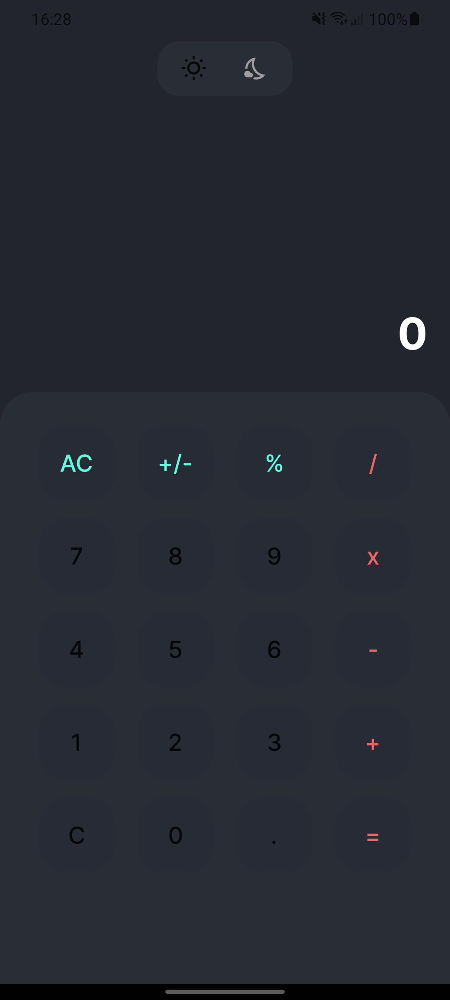

# Flutter - Projects | Frave Developer

### Yotube Channel
[Frave Developer](https://www.youtube.com/channel/UCkNYlmbx487MPmYvfSMAdRg)

### Social Media

### Donate

---
## APPs

## 01 - Password Manager App
    - Auth Local | Encrypt Password 

### PASSWORD MANAGER APP
<table border>
    <tr>
        <th style="text-align:center">Biometrics</th>
        <th style="text-align:center">Pin</th>
        <th style="text-align:center">Home</th>
    </tr>
    <tr>
        <td></td>
        <td></td>
        <td></td>
    </tr>
</table>

## 02 - Coffee App 

<table border>
    <tr>
        <th style="text-align:center">Presentation Screen</th>
        <th style="text-align:center">Home Screen</th>
        <th style="text-align:center">Gif App </th>
    </tr>
    <tr>
        <td></td>
        <td></td>
        <td></td>
    </tr>
</table>

### [Inspiration] (https://dribbble.com/shots/14166097-Coffee-App)

## 03 - Calculator App 
        - flutter-Bloc 

<table border>
    <tr>
        <th style="text-align:center">Home Screen Light</th>
        <th style="text-align:center">Home Screen Dark</th>
        <th style="text-align:center">Gif App </th>
    </tr>
    <tr>
        <td></td>
        <td></td>
        <td></td>
    </tr>
</table>

#### [Inspiration] (https://dribbble.com/shots/14709020-Calculator/attachments/6408579?mode=media)

## 04 - List Animation 

<table border>
    <tr>
        <th style="text-align:center">Gif App </th>
    </tr>
    <tr>
        <td></td>
    </tr>
</table>

### [Inspiration] (https://dribbble.com/shots/14857079-MVPs-Prototypes)

## 05 - CINEMA 

<table border>
    <tr>
        <th style="text-align:center">Gif App Cinema</th>
    </tr>
    <tr>
        <td></td>
    </tr>
</table>

### [Inspiration] (https://dribbble.com/shots/9527363-Movie-App/attachments/1554049?mode=media)